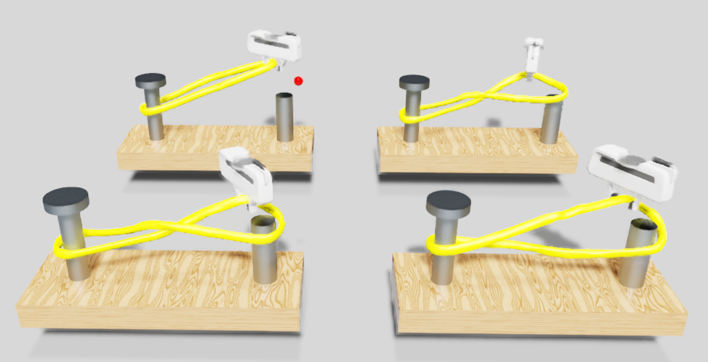

# TwistOring_env


Deformable object manipulation using RL &amp; implicit represenation learning

## Install
This repo based on NVIDIA Orbit & `IsaacSim 2022.2.1` version. \
You should install `NVIDIA Omniverse`, `IsaacSim 2022.2.1`, `NVIDIA Orbit`. 

1. Install NVIDIA Omniverse.
2. Install IsaacSim 2022.2.1.
3. Install NVIDIA Orbit
4. Install this repo in Orbit, `omni.isaac.orbit_envs/omni/isaac/orbit_envs/`.
5. Input this code in `~/Orbit/source/extensions/omni.isaac.orbit_envs/omni/isaac/orbit_envs/__init__.py`

```
gym.register(
    id="Soft-Oring-Entangled-v0",
    entry_point="omni.isaac.orbit_envs.Oring_entangled:OringEnv",
    kwargs={"cfg_entry_point": "omni.isaac.orbit_envs.Oring_entangled:OringEnvCfg"},
)
```

## **Environment Structure**
### **TwistOring** 


- We aim to employ reinforcement learning to **untangle an O-ring randomly entangled and stretched between two poles as an initial state**. The task of the agent, the robotic gripper, is to generate and execute actions to effectively untangle the O-ring and adeptly refit it onto the poles, ensuring no entanglement persists after the max episode step $N_{\text{max}}=50$.


#### **MDP settings**
- Episode length: 50 \
 z axis up: ~15 step [1.3] \
 z axis down: 15~50 step [-0.5]

- **Task Variations(Randomization)**\
 Oring twist[-360, -180, 180, 360], \
 rigid_pole y axis [1.3~1.6], \
 initial grasp point x: [-0.12, 0.12] y: [1.14~1.2]

- **Action** \
The actions is a = (dx, dy, d\theta), \
absolute velocity control : x, y, theta \
MultiDiscrete action x,y: [-0.5, 0, 0.5], theta [-3, 0, 3] \

- **State** \
EE related position (ee position - rigid pole) [3] \
latent vector [256] \
scale factor[4] \
z move states [1] 

- **Reward** \
penalizing chamfer distance bwn default oring and current oring \
(final step) oring is not twist and no fall \

